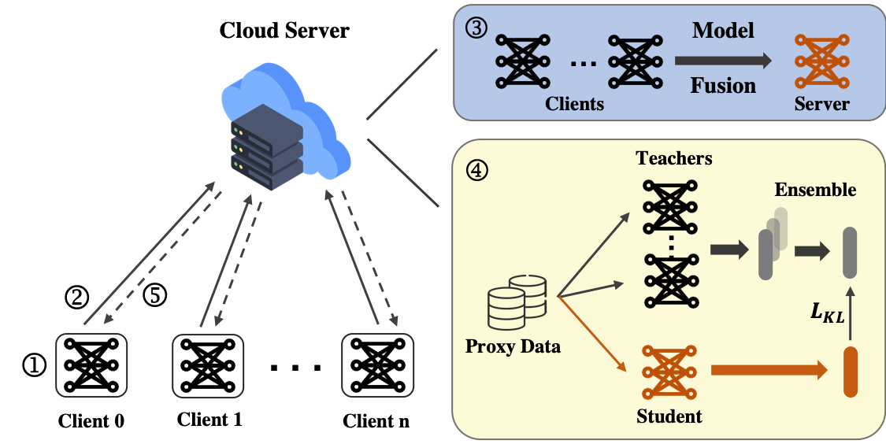

# FLEKD-IDS

Official implement of paper "Effective Federated Learning Using Ensemble Knowledge Distillation for Intrusion Detection in Heterogeneous Internet-of-Things Networks".


## Abstract

With the rapid development of low-cost consumer electronics and cloud computing, Internet-of-Things (IoT) devices are widely adopted for supporting next-generation distributed systems such as smart cities and industrial control systems. IoT devices are often susceptible to cyber attacks due to their open deployment environment and limited computing capabilities for stringent security controls. Hence, Intrusion Detection System (IDS) is widely accepted to be an effective approach for securing IoT networks by monitoring and detecting abnormalities. However, existing IDS approaches rely on centralized servers to generate behaviour profiles and detect anomalies, leading to high response times and operational costs due to high communication overhead.Besides, sharing of behaviour data in an open and distributed IoT network environment may violate on-device privacy requirements. Additionally, various IoT devices tend to capture heterogeneous data (including diverse feature dimensions, sample quantity, and different types of data), which complicates the training of behaviour models. In this paper, we introduce a Federated Learning (FL) approach to collaboratively train a decentralized shared model, without exposing training data to others. Furthermore, we propose an effective method called Federated Learning Ensemble Knowledge Distillation (FLEKD) to mitigate the heterogeneity problems across various clients. FLEKD enables a more flexible aggregation method than conventional model fusion techniques. Experiment results on the public dataset CICIDS-2019 demonstrate that the proposed approach outperforms local training and traditional FL in terms of both speed and performance. Finally, we evaluate our proposed framework’s performance in three potential real-world scenarios and show FLEKD has a clear advantage in experimental results.



## Datasets

* CICIDS-2019


## Experiment Commands

First, need to generate proxy dataset for KD:
```bash
python src/gen_proxy.py
```

iid situation:

```bash
CUDA_VISIBLE_DEVICES=0 python src/fl_main.py --KD --distill_epochs 2 --wk_iters 2 --iters 20
```

non-iid situation:
```bash
CUDA_VISIBLE_DEVICES=0 python src/fl_main.py --KD --noniid --alpha 1 --distill_epochs 2 --wk_iters 2 --iters 20
```

The impact of missing certain classes:

```bash
CUDA_VISIBLE_DEVICES=0 python src/fl_main.py --KD --drop_label --drop_strategy serial --distill_epochs 2 --wk_iters 2 --iters 20
```


## Citation

```
Under review
```
